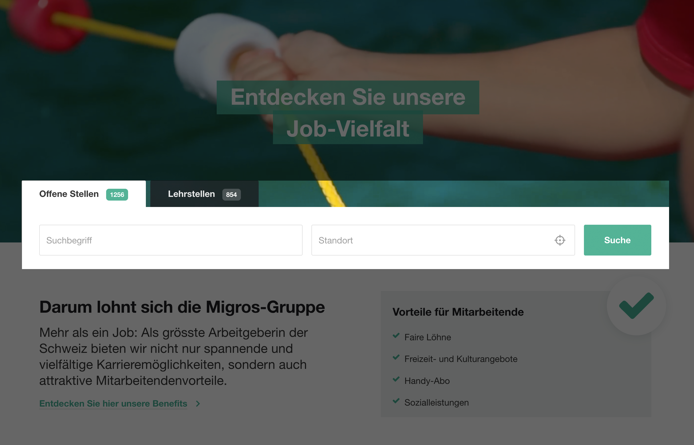

```fm
style: negative
background: true
```

## Hello _👋_

# {{process.content.frontmatter.title}}

_A Web Component Story_

<footer>

2024 · Zurich · Stefan Huber

</footer>

--s--

```fm
style: image
background:
  image: https://portrait.signalwerk.ch/illustration/2020/rgb/w4000/stefan-huber.jpg
  position: 50% 40%
```

## Stefan

<div class="box box--w40p box--bottom box--white box--padding small">

- Developer
- ❦ Typography

</div>

<footer class="footer--right">

Illustration by [Benjamin Güdel](http://www.guedel.biz/) · 2020

</footer>

--s--

## Overview (20min)

- Examples and Demos
- Bridge Frameworks
- Server-Rendering

--s--

```fm
style: negative
background: true
```

## Examples

# Low-Tech approach

_Use without a framework like React/Vue/Svelte_

--s--

## Slides

<div style="font-size: 0.7em;">

```html
<!DOCTYPE html>
<html lang="en">
  <head>
    <meta charset="utf-8" />
    <title>Slides</title>
    <script src="deck-component.js"></script>
    <script src="slide-component.js"></script>
    <script src="carousel-component.js"></script>
  </head>
  <body>
    <!-- page content -->
    <deck-component href="slides.md" />
  </body>
</html>
```

</div>

<footer>
It's not at all how I built this presentation. But let's start simple.
</footer>

--s--

## Slides

<div class="grid">
<div class="col4">

**slides.md**

<div style="font-size: 0.8em;">

```md
# Hello Slide 1

––s––

# World Slide 2
```

</div>

</div>
<div class="col8">

**HTML**

<div style="font-size: 0.8em;">

```html
<deck-component href="slides.md" />
```

</div>

</div>
</div>

--s--

## Component Slides

<div style="font-size: 0.7em;">

```js
// fetch from the href attribute
fetch(this.getAttribute("href"))
  .then((response) => response.text())
  .then((text) => {
    // split the slides
    const slides = text.split("––s––");

    // create slide components
    slides.forEach((slide) => {
      const slideElement = document.createElement("<slide-component>");
      slideElement.innerHTML = this.convertMarkdownToHtml(slide);
      this.shadowRoot.appendChild(slideElement);
    });
  });
```

</div>

--s--

## Slides

<div class="grid">
<div class="col4">

**slides.md**

<div style="font-size: 0.8em;">

```md
# Hello Slide 1

––s––

# World Slide 2
```

</div>

</div>
<div class="col8">

**DOM**

<div style="font-size: 0.8em;">

```html
<deck-component href="slides.md">
  #shadow-root
  <slide-component>...</slide-component>
  <slide-component>...</slide-component>
</deck-component>
```

</div>

</div>
</div>

--s--

## Slides

<div class="grid">
<div class="col4">

**slides.md**

<div style="font-size: 0.8em;">

```md
# Hello Slide 1
```

</div>

</div>
<div class="col8">

**DOM**

<div style="font-size: 0.8em;">

```html
<slide-component>
  #shadow-root
  <h1>Hello Slide 1</h1>
</slide-component>
```

</div>

</div>
</div>

--s--

## Slides

<div class="grid">
<div class="col4">

**slides.md**

<div style="font-size: 0.8em;">

```md
# Hello Slide 1

<carousel-component>


</carousel-component>
```

</div>

</div>
<div class="col8">

**DOM**

<div style="font-size: 0.8em;">

```html
<slide-component>
  #shadow-root
  <h1>Hello Slide 1</h1>

  <carousel-component>
    #shadow-root
    
    
    
  </carousel-component>
</slide-component>
```

</div>

</div>
</div>

--s--

## Hello Slide 1

<div class="box box--w60p">

<carousel-component>


</carousel-component>

</div>

--s--

## Styling

The _advantage_ and _disadvantage_ of Web Components is that they are **encapsulated**.

<hr />

### To style with a **Shadow DOM**

- `--css-variables` → define variables
- `:part()`-selector → styles a part of the component
- `:slotted()`-selector → styles a slotted element
- (`:host`-selector → styles the host element)

--s--

## Styling

<style>
.hr-thin { margin: 0;}

  warn-component {
      --font-size: 1rem;
  }
style.visible {
display: block;
font-size: 0.4rem;
padding: 0;
margin: 0;
}


</style>

<div class="grid">
<div class="col5">

<warn-component>
  <span>Text</span> <small>small</small>
</warn-component>

<div style="font-size: 0.45em">

<hr class="hr-thin"/>

```html
<div>
  <div class="name" part="name">Warning</div>
  <slot part="slotted-content"></slot>
</div>
```

<hr class="hr-thin"/>

```css
:host {
  background-color: var(--card-bg-color, red);
}
::slotted(small) {
  text-transform: uppercase;
}
```

</div>

</div>
<div class="col1">
</div>
<div class="col6">

<div style="font-size: 0.45em">

<hr class="hr-thin"/>

```html
<warn-component>
  <span>Text</span>
  <small>small</small>
</warn-component>
```

</div>

<pre>
<code>
<style class="visible" contenteditable data-lt-active="false">

warn-component {
  --card-bg-color: #f0f0f0;
}

warn-component::part(name) {
  color: red;
}

</style>
</code>
</pre>

</div>
</div>

--s--

```fm
style: negative
background: true
```

## Oportunity

# Bridge Frameworks

--s--

## Frameworks

- React
- Vue
- Svelte
- jQuery
- Angular
- Vanilla JS
- ...

--s--

## Drupal example (Twig)

<div class="img--border">


</div>

--s--

## Vue 2 example


--s--

## Vue 3 integration



--s--

## Vue 3 integration


--s--

## Vue 2 uses a Vue 3 component

<div style="font-size: 0.5em;">

```html
<template>
  <search-panel-component
    :job-count="globalCount.job"
    :lang="lang"
  ></search-panel-component>
</template>

<script>
  import { mapState } from "vuex";
  import { language } from "@/utils/search/getLanguage";

  export default {
    computed: {
      ...mapState(["globalCount"]),
    },
    data() {
      return {
        lang: language,
      };
    },
  };
</script>
```

</div>

--s--

## Bridge Frameworks

- _Build a Web Component_
  - Build-Step in your Framework
- _Make the Web Component available_
  - `<scrıpt src="web-component.js"></scrıpt>`
- _Render markup_
  - `<web-component></web-component>`

--s--

```fm
style: negative
background: true
```

## Really?

# Server-Rendering

--s--

## Do you need it?


--s--

## Do you need it?

<div style="font-size: 0.8em;">

```html
<!DOCTYPE html>
<html lang="de">
  <head>
    <meta charset="utf-8" />
    <title>…</title>
    <meta property="og:description" content="…" />
  </head>
  <body>
    <!-- page content -->
    <h1>Title of page</h1>
    <p>Text of page</p>
    <search-panel-component … />
  </body>
</html>
```

</div>

--s--

## Keep SEO in mind

<div style="font-size: 0.8em;">

```html
<carousel-component>
  <image-component path="./img/cat_a.jpg" />
  <image-component path="./img/cat_b.jpg" />
  <image-component path="./img/cat_c.jpg" />
</carousel-component>
```

</div>

--s--

## Keep SEO in mind

<div style="font-size: 0.8em;">

```html
<carousel-component>
  
  
  
</carousel-component>
```

</div>

--s--

## It's hard

- Web Components can contain _all kind of logic_
- Without a full **DOM/Browser** it might get hairy

--s--

## Example Migros MDX

<footer>

[Modal Migros MDX](https://mdx.migros.ch/latest/components/modal/usage-TJz3pHvg)

</footer>

```html
<mdx-button>
  <span>Label</span>
</mdx-button>
```

<br />

<mdx-button onclick="console.log('hi!')">
<span>Label</span>
</mdx-button>

--s--

## Example Migros MDX

<footer>

[Modal Migros MDX](https://mdx.migros.ch/latest/components/modal/usage-TJz3pHvg)

</footer>

```html
<mdx-date-picker></mdx-date-picker>
```

<mdx-date-picker
        month-mode-title="Select a month"
        year-mode-title="Select a year"
        return-button-label="Return to calendar"
        cancel-button-label="Cancel"
        submit-button-label="Submit"
        input-label="Date"
        language="de"
        arrowuparialabel="Move back in time"
        arrowdownarialabel="Move forward in time"
      ></mdx-date-picker>

--s--

## Adapt

- Take rendering of the «original» framework
- Hydration works

--s--

## Render React in Vue

<!-- # ⚠️ add date-picker and SSR -->

<div style="font-size: 0.8em;">

```html
<template>
  <mdx-button>Label</mdx-button>
</template>
```

</div>

--s--

## Vue `<mdx-button />`

<style>

::-webkit-scrollbar {
  -webkit-appearance: none;
  width: 8px;
}
::-webkit-scrollbar-thumb {
  border-radius: 4px;
  background-color: rgba(0, 0, 0, .5);
  -webkit-box-shadow: 0 0 1px rgba(255, 255, 255, .5);
}
</style>

<div style="font-size: 0.75em; overflow-y: scroll; height: 14rem;">

```html
<template>
  <div ref="reactRoot" v-html="ssrContent"></div>
</template>

<script setup>
  import { onMounted, ref } from "vue";
  import React from "react";
  import { renderToString } from "react-dom/server";
  import { hydrateRoot, createRoot } from "react-dom/client";

  import mdxButton from "../react/mdx-button";

  const reactRoot = ref(null);
  let root = null;

  const ssrContent = ref("");

  if (process.server) {
    ssrContent.value = renderToString(mdxButton);
  }

  if (process.client) {
    onMounted(() => {
      if (reactRoot.value) {
        root = hydrateRoot
          ? hydrateRoot(reactRoot.value, component)
          : createRoot(reactRoot.value).render(component);
      }
    });
  }

  onBeforeUnmount(() => {
    if (root) {
      root.unmount();
    }
  });
</script>
```

</div>

--s--

```fm
style: negative
background: true
```

## exit 0; thx

# Questions?
